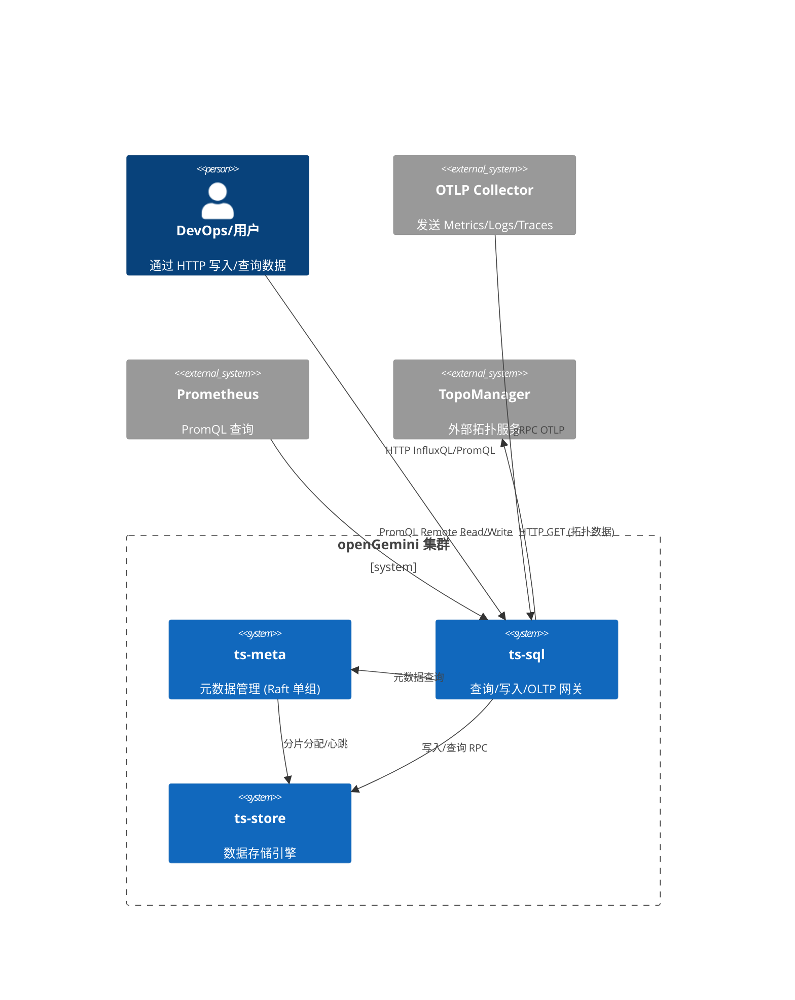

# Architecture Review: openGemini 分层架构与多模扩展性

## 1. 架构总览

openGemini 采用经典的三层时序数据库架构 (ts-meta + ts-sql + ts-store)，源自从 InfluxDB 1.x 的 fork (VictoriaMetrics 线路协议 + InfluxDB 1.x 的 meta/coordinator 包)。在此基础上增加了 OTLP 多模(metrics/logs/traces)写入、PromQL 转译、图查询(Topology)语法扩展等。

```
                           ┌──────────────┐
                           │   ts-meta     │  Hashicorp Raft (单组)
                           │  (元数据)      │  路由/拓扑/Shard分配
                           └──────┬───────┘
                                  │ RPC + Gossip
              ┌───────────────────┼───────────────────┐
              │                   │                    │
       ┌──────┴──────┐    ┌──────┴──────┐    ┌───────┴────────┐
       │   ts-sql     │    │  ts-sql     │    │   ts-sql       │
       │ (查询/写入)   │    │             │    │                │
       │ - HTTP(S)   │    │ - PromQL    │    │ - OTLP 入口    │
       │ - InfluxQL  │    │ - 流计算    │    │ - 持续查询     │
       └──────┬───────┘    └──────┬──────┘    └───────┬────────┘
              │                   │                    │
              └───────────────────┼───────────────────┘
                                  │ SPDY RPC
                         ┌────────┴────────┐
                         │    ts-store     │ etcd Raft (每 PT 一组)
                         │   (存储引擎)     │
                         │ TSI / ColStore  │
                         │ WAL / 压缩      │
                         └─────────────────┘
```

## 2. C4 Level 1 现状图



## 3. C4 Level 2 现状图

```mermaid
C4Container
  Boundary(meta_layer, "ts-meta 节点 (×3-5)") {
    Container(meta_raft, "Hashicorp Raft", "单 Raft 组, 60+ 命令类型")
    Container(meta_fsm, "FSM (storeFSM)", "全量元数据状态机")
    Container(meta_cache, "CacheData", "100ms+10s 双频同步")
    Container(cluster_mgr, "ClusterManager", "PT 分配/迁移/均衡")
  }

  Boundary(sql_layer, "ts-sql 节点 (×N)") {
    Container(http_handler, "HTTP Handler", "InfluxQL/LineProtocol/OTLP/PromQL 端点")
    Container(promql_transpiler, "PromQL Transpiler", "promql2influxql 转译")
    Container(coordinator, "Coordinator", "PointsWriter/ShardMapper/StatementExecutor")
    Container(stream_engine, "Stream Engine", "流聚合 (窗口/过滤)")
    Container(graph_transform, "GraphTransform", "拓扑查询 (调用外部 TopoManager)")
  }

  Boundary(store_layer, "ts-store 节点 (×N)") {
    Container(transport, "Transport Server", "SPDY RPC 监听 ingest/select")
    Container(storage, "Storage Engine", "Shard/Partition/Index 管理")
    Container(raft_per_pt, "Raft Per PT", "etcd Raft, 每 DB+PT 一组")
    Container(tsi_index, "TSI Index", "倒排索引")
    Container(col_store, "ColStore", "列存引擎 (parquet)")
    Container(wal, "WAL", "Write-Ahead Log")
  }

  Rel(http_handler, coordinatior, "写入/查询")
  Rel(coordinator, meta_raft, "获取 ShardGroup/PT 路由")
  Rel(coordinator, storage, "写入行/RPC")
  Rel(graph_transform, topo_manager, "HTTP 获取拓扑数据")
  Rel(raft_per_pt, raft_per_pt, "跨节点 Raft 复制")
```

## 4. 组件职责边界分析

### 4.1 ts-meta 职责与瓶颈

**现状**: ts-meta 使用单一 Hashicorp Raft 组管理所有集群元数据。`Store` 结构体 (store.go:381) 中 `data *meta.Data` 是一个巨型内存对象，包含所有 database/retention-policy/measurement/shard/index-routing/用户权限/流任务 信息。

**关键瓶颈**:
- **单 Raft 组写入串行化**: 所有 DDL (create/drop/alter) 和 shard 分配命令通过同一 Raft 组提交。`store_fsm.go:33-75` 的 `ApplyBatch` 持有 `s.mu.Lock()` 和 `s.cacheMu.Lock()` 双重锁。
- **缓存同步延迟**: `updateCacheInterval=100ms` (store.go:70) + `pushInterval=10s` (store.go:72) 的 pull-based 同步策略导致 ts-sql 端最差 100ms 的元数据延迟。`serveSnapshot()` (store.go:980) 依赖 `time.After(updateCacheInterval)` 轮询。
- **元数据内存膨胀**: 10 万实体 + 高基数 tag 下，`meta.Data` 包含所有 measurement schema、shard 信息、索引关系。`GetData()` (store.go:856) 直接返回指针引用，无内存上限保护。
- **FSM 状态机增长复杂**: `applyFunc` (store_fsm.go:112-178) 已有 60+ 命令类型，每种新增特性(流、持续查询、downsample、replication 等)都往 FSM 追加命令。

**证据**: `app/ts-meta/meta/store.go:70-73`, `app/ts-meta/meta/store_fsm.go:33-75`, `app/ts-meta/meta/store_fsm.go:112-178`, `app/ts-meta/meta/store.go:927-943`, `app/ts-meta/meta/raft_wrapper.go:73`

### 4.2 ts-sql 职责过载

**现状**: ts-sql 同时承担 HTTP 网关、查询执行协调器、PromQL 转译器、OTLP 转换器、流计算协调器、持续查询调度器等多重角色。`Server` 结构体 (sql/server.go:64-103) 包含 15+ 子服务。

**问题**:
- **职责混杂**: `initQueryExecutor()` (sql/server.go:300) 同时初始化 `StatementExecutor`、`ShardMapper`、`TaskManager`。写入路径 `PointsWriter` (sql/server.go:74) 直接持有 TSDBStore 引用。
- **目标规模下的写入协调负担**: `PointsWriter.RetryWritePointRows()` (coordinator/points_writer.go:238) 在写入前需要串行执行: checkDBRP -> createShardGroup -> getDstStreamInfos -> 逐行 route -> writeShardMap。在 1 亿 metrics/s 下，每行都需要多次 RPC 到 ts-meta。
- **缺乏独立的 ingestion gateway**: 所有数据(HTTP LineProtocol, OTLP, ArrowFlight, Prometheus RemoteWrite) 都通过同一 ts-sql 进程，没有独立的写入网关做削峰填谷和背压。
- **拓扑查询依赖外部 HTTP 服务**: `GraphTransform` (engine/executor/graph_transform.go:137) 调用 `util.GetClientConf().SendGetRequest()` (lib/util/graph_client.go:86) 获取拓扑数据，该服务必须独立部署。

**证据**: `app/ts-sql/sql/server.go:64-103`, `app/ts-sql/sql/server.go:300-336`, `coordinator/points_writer.go:238-333`, `engine/executor/graph_transform.go:137-187`

### 4.3 ts-store 职责合理但 replication 路径复杂

**现状**: ts-store 承载存储引擎(TSI 列存混布)、Raft 数据复制、流计算引擎。每个 PT (Partition) 有一个独立的 etcd Raft 节点 (`raftconn/node.go:108`)。

**问题**:
- **Raft 组数量膨胀**: 目标 10 万实体下，如果 DB 数量多、PT 数量大，Raft 组数量可能达到数百甚至上千。每个 Raft 组有独立的 `RaftNode` 结构体 (raftconn/node.go:57)。
- **存储引擎抽象**: `Shard` 接口 (engine/shard.go:117) 定义良好但不区分时序引擎和列存引擎的物理实现差异。

**证据**: `app/ts-store/run/server.go:56-81`, `lib/raftconn/node.go:57-106`, `lib/raftconn/node.go:108-158`, `engine/shard.go:117-150`

### 4.4 协调层(coordinator) 无独立服务

**现状**: `coordinator` 包是 ts-sql 和 ts-store 共享的库代码，不作为独立进程部署。`PointsWriter`/`ShardMapper`/`StatementExecutor` 都在 ts-sql 地址空间运行。

**问题**:
- 在 1 亿 metrics/s 目标下，coordinator 的 `ShardMapper` (coordinator/shard_mapper.go:52) 需要在每次查询时遍历所有 shard group 做路由决策。`mapMstShards()` (shard_mapper.go:144) 调用 `MetaClient.ShardGroupsByTimeRange()` 获取所有相关 shard group，然后逐组计算 target shards。

**证据**: `coordinator/statement_executor.go:1-39`, `coordinator/shard_mapper.go:144-194`, `coordinator/points_writer.go:854-893`

## 5. 多模数据模型评估

### 5.1 Metrics/Logs/Traces 存储

Metrics、Logs、Traces 全部以 `influx.Row` 格式存储在同一个 storage engine 中：
- OTLP Protobuf 在入口层由 `otel2influx` 库转为 `influx.Row` (lib/opentelemetry/otlp_writer.go:171-250)
- 使用同一 `PointsWriter.RetryWritePointRows()` 写入路径
- 所有数据共享同一个 TSI 索引、同一个 shard 分配策略

**无差异化存储引擎**: 日志和 trace 的高基数字段(如 `span_id`, `trace_id`, `service.name`, `body`)与传统时序指标的数值型 field 高度混合。Logs 的 `body` 字段以 string field 存储，尚未确认接入现有全文索引查询路径。

**缺失 LogQL 与日志 body 全文查询接入**: 代码中已存在全文索引相关实现 (`engine/index/clv/search.go`, `engine/index/textindex/`)，但未发现 OTLP log body 自动写入/查询该索引的路径，也未发现 LogQL 解析或转换层。当前 Logs 查询主要依赖 InfluxQL 的 `=`, `!=`, `=~` (正则)过滤，无法形成 LogQL-style 的日志全文检索体验。

**证据**: `lib/opentelemetry/otlp_writer.go:171-250`, `lib/opentelemetry/otlp_writer.go:277-282`, `lib/util/lifted/influx/httpd/handler_otlp.go:104-170`, `engine/index/clv/search.go`, `engine/index/textindex/`

### 5.2 拓扑(Topology) 查询

Topology 是一个"外挂"能力：
- 语法层: `GraphStatement` (ast.go:12282-12289) 定义了 `NodeCondition`, `EdgeCondition`, `HopNum`, `StartNodeId`
- 执行层: `GraphTransform.Work()` (graph_transform.go:137) 不查询本地存储引擎，而是向外部的 `TopoManager` HTTP 服务发起 GET 请求
- 拓扑图完全由外部服务构建，openGemini 只做多跳过滤 (`graph.MultiHopFilter`) 和结果渲染
- `TopoManager URL` 通过配置文件传入 (sql/server.go:205: `util.SetTopoManagerUrl(c.Topo.TopoManagerUrl)`)

**结论**: 1M 拓扑边不受 openGemini 存储引擎管理，全靠外部 TopoManager。openGemini 只做展示层的多跳过滤。这不适用于生产 RCA 场景——跨模关联(metrics+logs+traces+topology)需要在一个系统中完成联合下钻。

**证据**: `lib/util/lifted/influx/influxql/ast.go:12282-12341`, `engine/executor/graph_transform.go:137-187`, `lib/util/graph_client.go:41-115`, `lib/util/lifted/influx/coordinator/statement_executor.go:2824-2847`

### 5.3 跨模关联

搜索 `rg "cross.*measurement|cross.*join|cross_measurement|跨模"` 无结果。`Join` 结构体 (ast.go:7442-7448) 存在但仅在 `mapShards()` (coordinator/shard_mapper.go:291-297) 中处理 shard 路由，不支持真正的跨 measurement join 执行。InfluxQL 的 `SubQuery` 和 `CTE` 是唯一可用的跨 measurement 查询方式，但性能不足以支持生产 RCA 场景的秒级响应。

## 6. 风险矩阵

| 风险项 | 影响面(单点/局部/全局) | 概率(低/中/高) | 证据(文件:行号) |
|--------|----------------------|---------------|-----------------|
| ts-meta 单 Raft 组成为写入瓶颈 | 全局 | 高 | app/ts-meta/meta/store.go:381-396; store_fsm.go:33-75 (ApplyBatch 持有双重锁) |
| 元数据内存无上限导致 OOM | 单点->全局 | 中 | app/ts-meta/meta/store.go:856-862 (GetData 直接返回引用, 无内存上限) |
| 缓存 100ms 同步延迟致路由不一致 | 局部 | 中 | app/ts-meta/meta/store.go:70 (updateCacheInterval=100ms), store.go:980-998 (serveSnapshot 轮询) |
| 多模数据共享引擎致日志查询低效 | 全局 | 高 | lib/opentelemetry/otlp_writer.go:171-250 (统一 influx.Row); 已有全文索引代码但缺少 OTLP log body 查询接入 |
| 拓扑查询依赖外部 HTTP 服务停机 | 全局 | 高 | engine/executor/graph_transform.go:161-168; lib/util/graph_client.go:86-115 |
| 无 ingestion gateway 致写入抖动时雪崩 | 全局 | 高 | coordinator/points_writer.go:238-333 (无端到端背压/限流机制) |
| ShardKey 高基数致 shard 爆炸 | 局部 | 中 | coordinator/shard_mapper.go:144-194 (按时间片全量查 shard) |
| 存储 Raft 组数量膨胀 | 单点 | 中 | lib/raftconn/node.go:57-106 (每 PT 一个 RaftNode, 含独立 DiskStorage) |
| PromQL 转译有损 | 局部 | 高 | lib/util/lifted/promql2influxql/transpiler.go:46-58 (递归转译有类型限制) |
| 跨模关联查询缺失 | 全局 | 高 | ast.go:7442-7448 (Join 仅做 shard 路由, 无执行); 无 cross-measurement join |
| GraphStatement 认证凭据硬编码 | 局部 | 中 | lib/util/graph_client.go:93 ("X-Auth-Token" 为空串, TODO 注释) |
| 查询无端到端超时级联 | 局部 | 中 | coordinator/points_writer.go:862 (仅用 time.Since 自旋); 无 context.WithTimeout 传递链 |
| FSM 命令数量不断增长 | 局部 | 高 | store_fsm.go:112-178 (60+ 命令类型, 每个新特性在 FSM 追加) |
| 存储引擎不区分时序/日志物理存储 | 全局 | 中 | engine/shard.go:117-150 (Shard 接口统一, 无日志专用实现) |

## 7. 重构建议

| 现状 | 问题 | 方案 | 成本档(S/M/L/XL) | 收益 |
|------|------|------|-----------------|------|
| ts-meta 单 Raft 组管所有元数据 | 100K 实体下写入串行化、内存膨胀 | 拆分拓扑层 vs. 数据字典元数据 Raft 组; 引入多组 Hashicorp Raft; 或迁移至 etcd/Consul | XL | 消除元数据瓶颈, 支撑 10 万+ 实体 |
| ts-sql 承载所有网关+协调功能 | 职责混杂, 1e8/s 写入下 CPU/内存爆炸 | 拆分独立 ingestion gateway (仅协议转换+行缓冲), 独立 query coordinator (仅 shard 路由+计划生成) | XL | 水平扩展写入/查询, 独立背压 |
| 元数据缓存 100ms 轮询 | 路由延迟, 写入冲突 | 改为 push-based gossip 或 etcd watch; 10s 全量推送改为增量 diff | M | 减少元数据不一致窗口 |
| 所有数据共享存储 | 日志 body 未接入全文查询, 且无 LogQL | 复用/完善已有 CLV/textindex, 接入 body 字段索引与查询路径; 为日志创建独立 shard 类型 | L | 支撑日志查询场景 |
| 拓扑依赖外部 HTTP 服务 | 拓扑数据不可在系统内关联 | 在 openGemini 内建拓扑图存储引擎, 支持 GraphStatement 直接查询本地存储 | XL | 生产 RCA 秒级跨模下钻 |
| 无端到端超时级联 | 一个慢查询击穿存储节点 | 从 HTTP handler 到 engine scan 传递 context.WithTimeout | S | 防止慢查询扩散 |
| PromQL 转译执行 | 有损转换 | 实现原生 PromQL 执行引擎(直接理解 promql/parser AST) | XL | 完全 PromQL 兼容 |
| ShardKey 静态配置 | 基数变化难以重分布 | 引入一致性哈希环+虚拟节点, 支持在线 shard split/merge | XL | 弹性伸缩 |
| 无跨模 join 执行 | 无法做 metrics+logs+topology 关联 | 实现 HashJoin/MergeJoin 算子, 支持跨 measurement 关联 | L | 支撑 RCA 关联分析 |
| Per-PT Raft 组 | 数百 Raft 组导致开销膨胀 | 评估在 DB 级别共享 Raft 组; 或 batch raft propose | L | 降低 Raft 管理开销 |

## 8. 关键结论

1. **最根本风险**: ts-meta 的单一 Raft 组 + 全内存的状态机模型在 10 万实体目标下会成为瓶颈。单个 `meta.Data` 对象包含全部集群元数据, FSM `ApplyBatch` 持有 `mu+cacheMu` 双锁 (store_fsm.go:36-40), 不可通过加节点水平扩展。

2. **最大缺口**: 跨模关联查询能力缺失。Topology 数据在外部、Logs 缺少 LogQL/body 全文查询接入、Traces 展开到扁平行, 无法在系统内完成 metrics -> traces -> logs -> topology 的关联下钻。生产 RCA 需要此能力。

3. **最大收益/成本比**: 独立的 ingestion gateway (拆分 ts-sql 职责)和端到端超时级联是两个成本相对低但收益显著的改进。

4. **Ts-store Raft 组规模风险**: 每 PT 一组 etcd Raft, 目标规模下可能达到数百组。当前 `raftconn/node.go:57-106` 的设计每节点实例化 N 个 RaftNode + N 个 goroutine 循环。建议评估是否可以在 DB 级别共享 Raft 组而非每 PT 一组。
